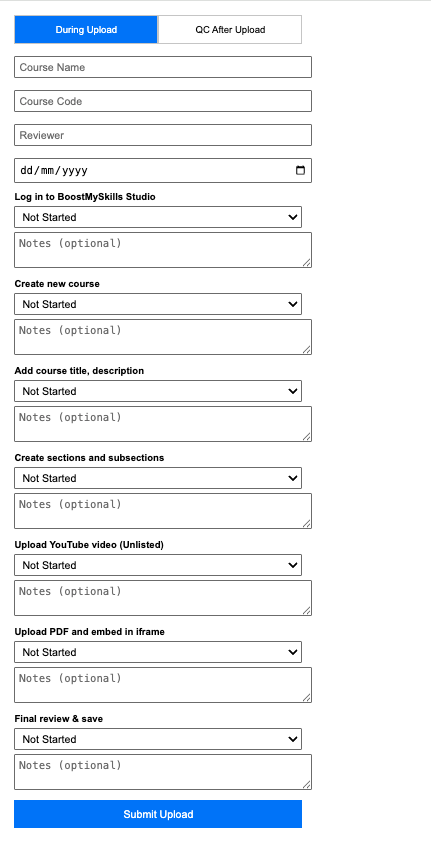
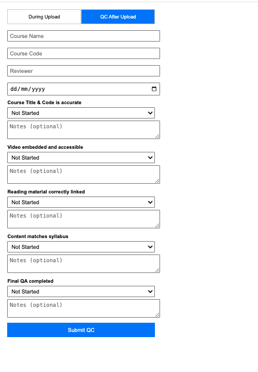

# Res4City QC Chrome Extension

A lightweight Chrome extension to log course upload & QC check‑lists directly into Google Sheets.

---

## Features

- **Two modes**  
  1. **During Upload** – log each upload step’s status & notes  
  2. **QC After Upload** – log each QC check’s status & notes  

- **Auto % Complete** calculation  
- **One‑click submit** to Google Apps Script webhook  
- Logs flow into two Sheets: `DuringUpload` & `QCAfterUpload`

---

## Installation

1. **Clone** this repo:
   ```bash
   git clone https://github.com/Saichandranellikanti/QC‑Extension‑For‑Res4City.git
   cd QC‑Extension‑For‑Res4City

 ## Screenshots



